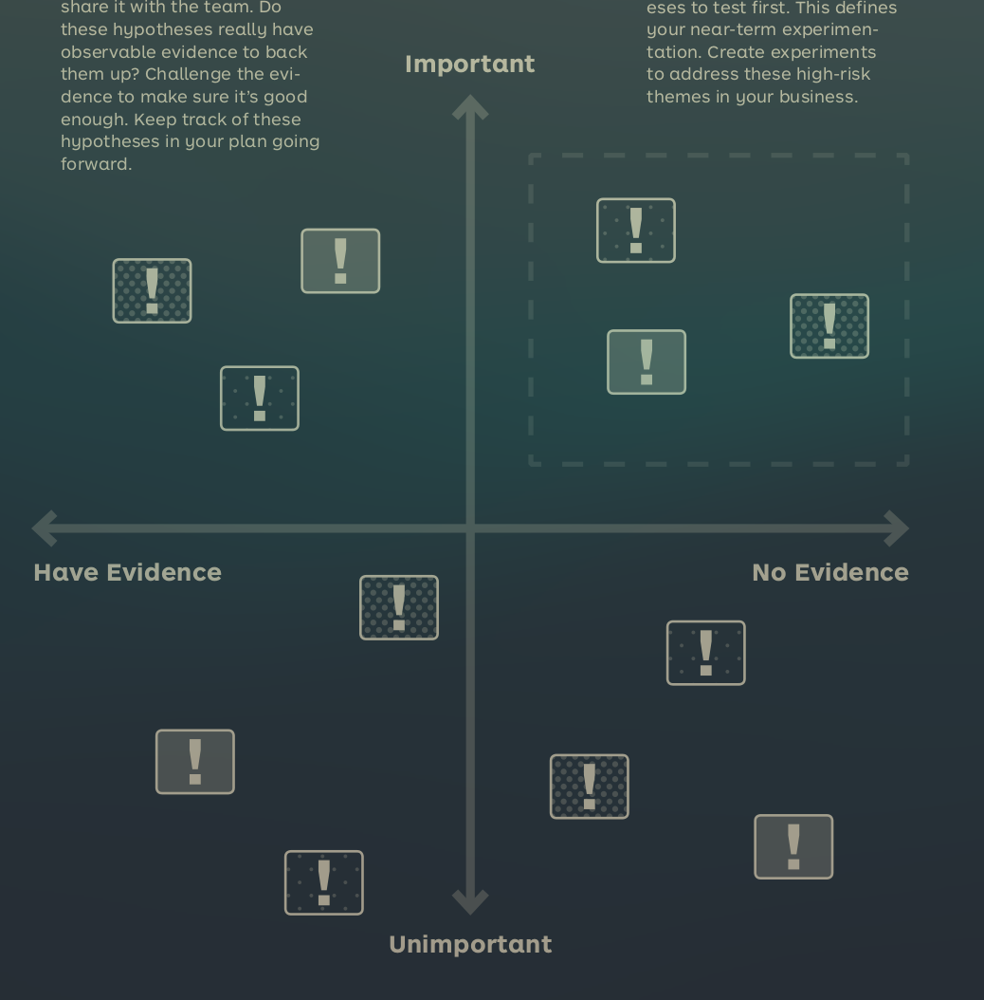

See also: [[OtherNote]]

# Assumption Mapping
Assumption mapping creates hypotheses out of risks and helps selecting which to focus on in testing. The following sections describe the different steps

## Step 1: Identify Hypotheses
Use sticky notes and write down hypotheses on the relevant Canvas, see more in [[Hypothesize]]. 

## Step 2: Prioritize
It is important to prioritize the hypotheses. The most important hypotheses are those that affect the viability of the idea the most. The hypotheses should also be weighted on how much evidence you have for it. The most important hypotheses with the least information are those that you should focus on.

## Step 3: Identify and Prioritize the riskiest Hypotheses
The top right quadrant from the earlier step, the one with high importance and no evidence is the one that should be tested first.
