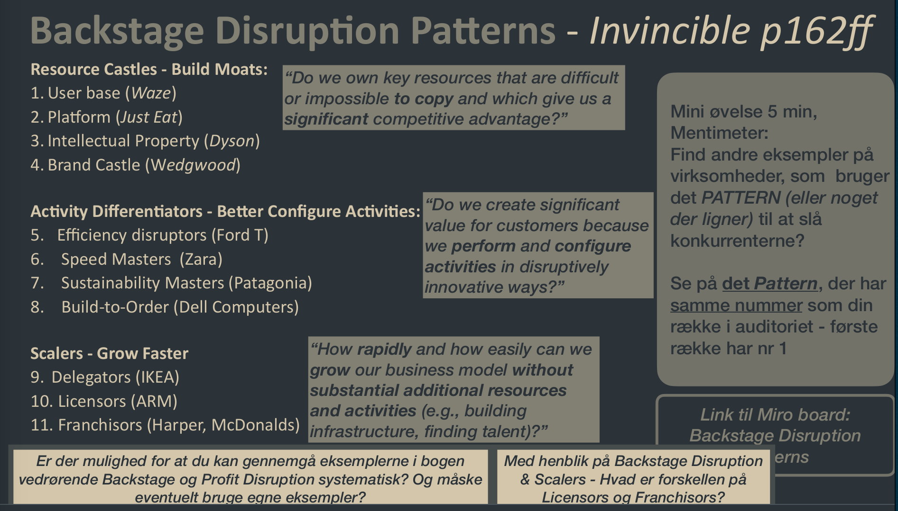

See also: [[Disruption]], [[Profit Formula Disruption]]

# Backstage disruption 
En del af at undersøge nye forretningsmodeller. 

## Patterns

### Resource Castles
Gain a competetive advantage by obtaining or creating Key Resources that are impossible to copy.

**Examples**

- User Base Castles: Advantage is gained by having more users (Waze)
- Platform Castles: Advantage is gained by having users that create value for other users (Ebay, Facebook, Strava)
- IP Castles: Advantage is gained by having Intellectual Property (Dyson)
- Brand Castle: Advantage is gained by being a well known brand (Rolex)

### Activity Differentiators
Gain a competetive advantage by changing how they create value for customers.

**Examples**

- Efficency Disruptors: Become more efficient (Ford Model T, China)
- Speed masters: Become faster (Zara)
- Sustainability Master: Become more environmentally friendly, usually costs more (Patagonia)
- Build-to-Order: Match the exact specifications of customers (Dell Computers)

### Scalers
Gain a competetive advantage by scaling faster than everyone else

**Examples**

- Designators: Increase scalability by moving key activities to partners (IKEA)
- Licensors: Increase scalability by selling a license to do the actual work (ARM)
- Franchisors: Inrease scalability by outlicensing the brand and product to franchisees who do the work (Subway)

[Miro board](https://miro.com/app/board/uXjVPJaYRto=/)

