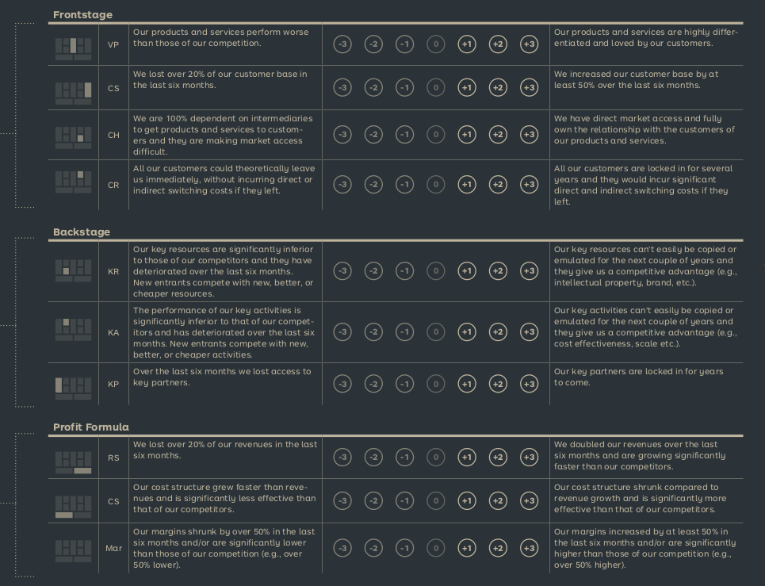
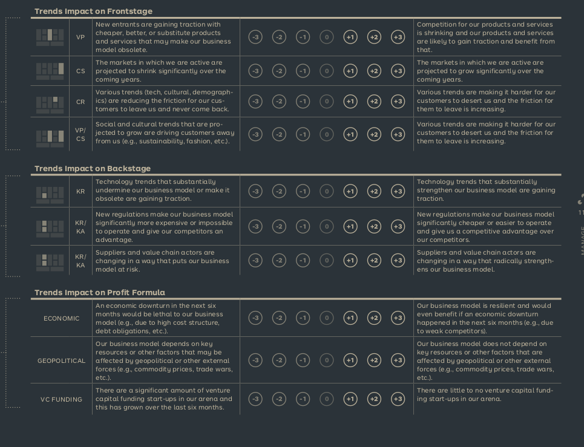
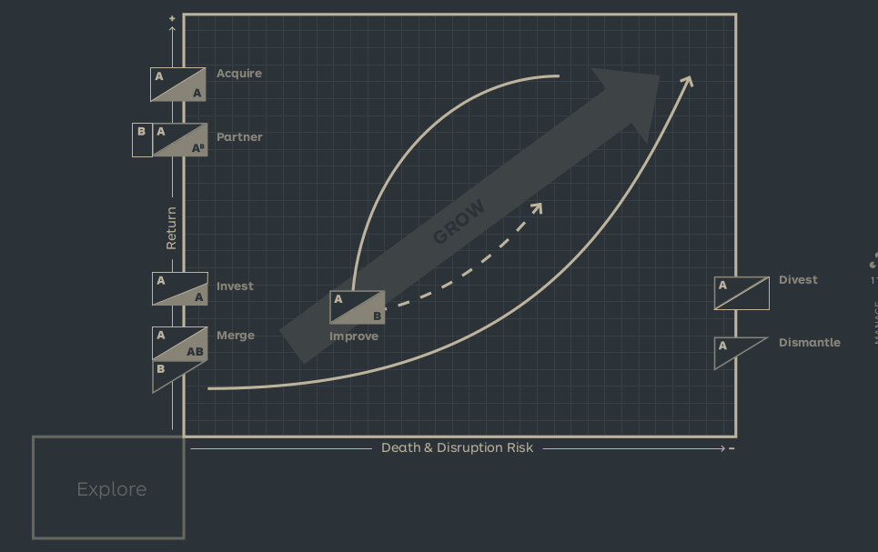

# Business Model Design Performance

Done to find out how vulnerable or disruptable a business model is. Used for the x-axis of the [[Exploit]] risk. Consists of 2 elements:

## Performance Assessment

Evaluates the current position on the x-axis. Basically reveals how healthy or at risk a business model is.

## Trend Assessment

Evaluates the future position on the x-axis. Basically reveals how healthy or at risk a business model is expected to be in the future.

## To action

After the assessment one or more actions are to be taken:

- Acquire: Acquire an existing business to plug a hole in an existing portfolio or to strengthen internal business.
- Improve: Improve the business by renovating a declining business model.
- Divest: Dismantle or sell a underperforming business.
- Invest: Take advantage of an external company's success by investing in it. Can be an alternative to acquiring a business.
- Partner: Partnering at the portfolio level can be useful if it affects most of your business model. These partnerships are strategic and affects multiple business models

