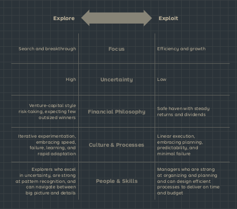
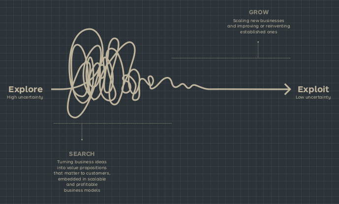

See also: [[Business Model]], [[Portfolio Map]]

# Business Model Portfolio
The few companies that get to close to invincibility are the ones that constantly reinvent themselves. Those have a portfolio of Business Model's.

## Definition
The collection of existing business models a company exploits and the new business models it explores in order to avoid disruption and ensure longevity.

## [[Portfolio Map]]
A tool to visualize, analyze and manage the portfolio of business models that the company is improving.

## Portfolio Dichotomy
The idea that there are 2 portfolios, the explore and the exploit portfolio. The explore portfolio is the one that is used to explore new business models. The exploit portfolio is the one that is used to exploit the business models that are already working.

## Portfolio Management
The process of managing the portfolio of business models. It requires 3 activities:

- Visualize
  - Create a shared visual language to communicate the portfolio of business models.
- Analyze
  - Analyze which business models are the most profitable, which are most at risk and which ones we should explore to create growth.
- Manage
  - Continuously grow and improve existing business models by shifting old ones to new models, while protecting the existing ones.

## Explore vs exploit
Exploring is a high risk activity focused on searching and breakthroughs. While exploiting is rather low risk and focused on growth. No company should focus on just one though.

