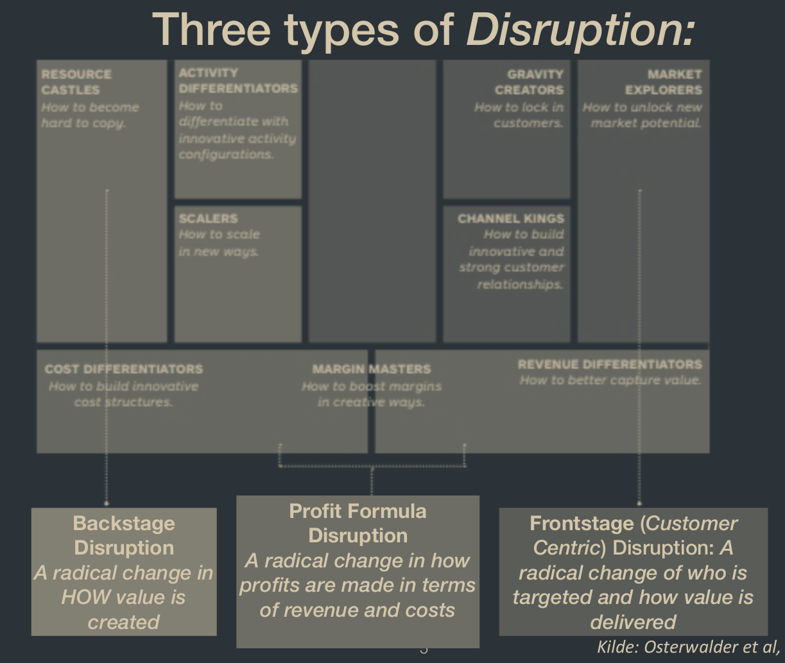

# Disruption
There are three types of disruption.

## [[Backstage Disruption]]
A radical change in how value is created

## Profit Formular Disruption
A radical change in how profits are made in terms of revenue and costs

## Frontstage disruption
See also: [[Frontstage Disruption]]

A radical change of who is targeted and how value is delivered

