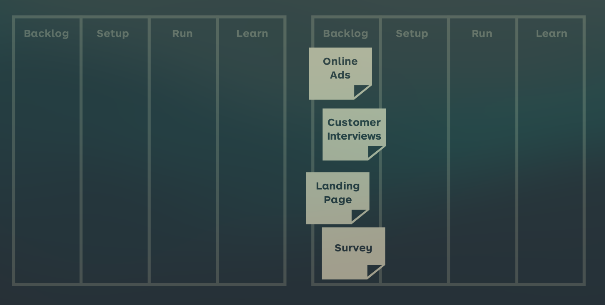

See also: [[Test]], [[Experiment Selection]]

# Experiment Flow
Since the goal of experimenting is to limit business uncertainty you should run multiple experiments over time. That means experiment progress should flow continously. Therefore there are a few principles you should follow.

## #1 - Visualize Your experiments
Make your work visible and understandable. Kanban boards are a good tool for this. Do this:

- Write down your experiments
- Draw a board
- Add your experiments to the backlog column
- Move them accordingly to their progress

## #2 - Limit Experiments in Progress
Multitasking too much can lead to confusion or bad work, so you should define a limit of how many experiments can be in each column at a time.

## #3 - Continous Experimentation
Experiment with your own workflow over time. Fx you should try to identify blocking experiments and find ways around it. The retrospectives can be good for this. Experimentation may never stop. You could also add a new setup column for waiting experiments or something.

