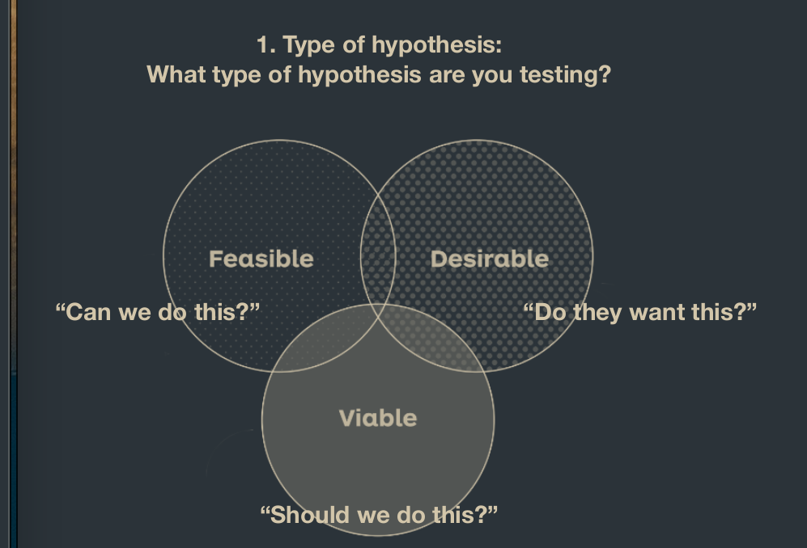
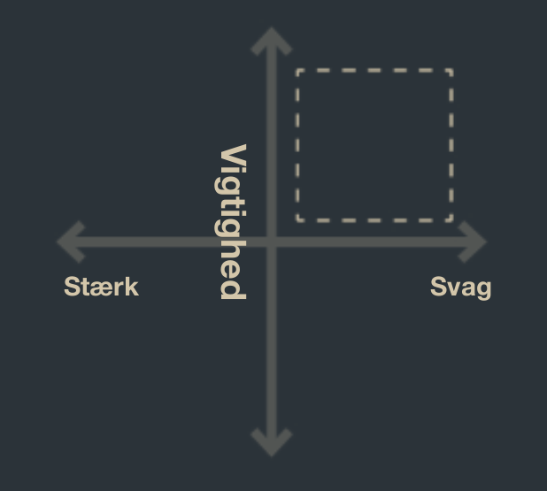
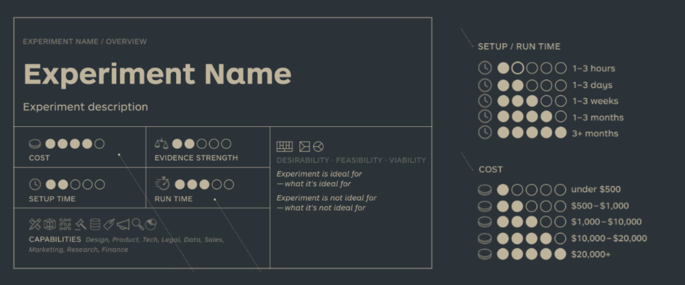
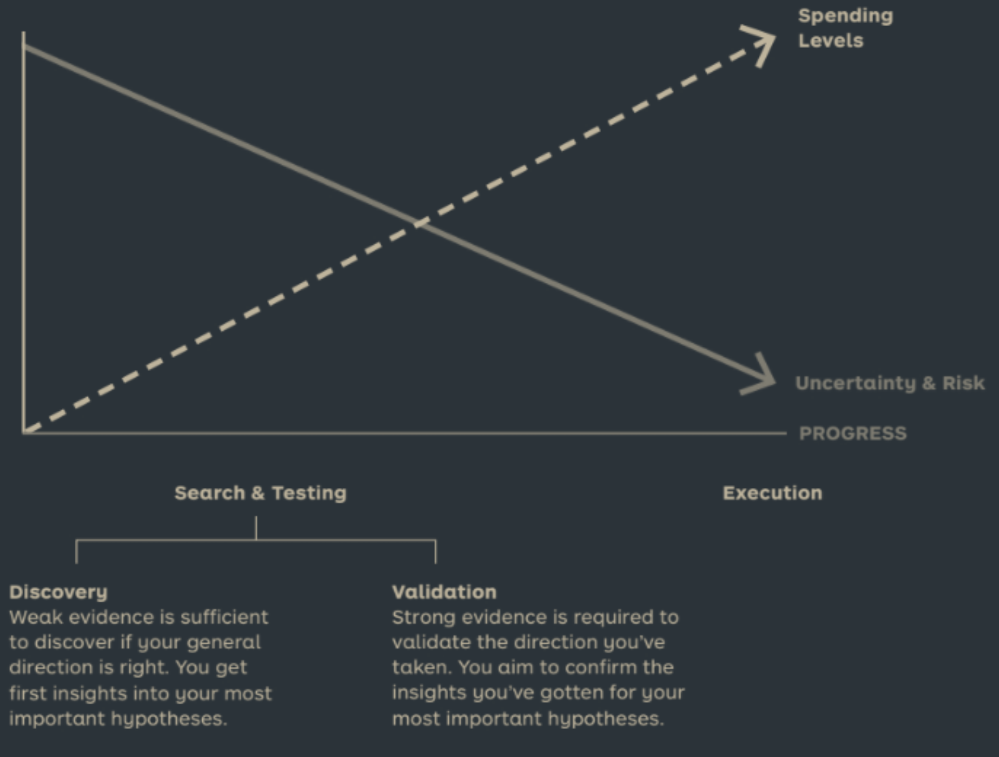

See also: [[Test]], [[Discovery Experiments]],  [[Validation Experiments]]

# Experiment Selection
The process of figuring out what to test. And how to get strong evidence.

## The questions
### Type of hypothesis
What type of hypothesis are you testing?

### Level of uncertainty
How much evidence do you already have (for a specific hypothesis)?

x-axis: Strong and weak evidence
y-axis: How important is the evidence?

### Urgency
How much time do you have to complete the experiment? When is the next decision to be made?

## Evaluate the experiment
Use the card below to evaluate what the evidence provides, and how much it takes to do it. 

## Workflow rules of thumb
- Go cheap and fast in the beginning
- Increase the strength of evidence with multiple experiments for the same hypothesis
- Always pick the experiment that produces the strongest evidence given your constraints
- Reduce uncertainty as much as you can before you build anything

## Experiment pitfalls
- Time trap
  - Don't force timelines that make the experiment suffer
- Analysis Paralysis
  - Don't keep Analysing instead of validating and experimenting more
- Incomparable Data/Evidence
  - Correlation does not imply causation. Look at the Nicolas Cage Swimming Pool chart
- Weak Data/Evidence
- Too Few experiments
- Confirmation bias
  - Don't do the experiments in a echo chamber. And look at the evidence objectively
- Failure to learn and adapt
  - Just ignoring the experiments. Change according to what the data tells you, even if you don't like the results.
- Outsource testing
  - Doing the experiments on your own provides more value, some outsourcing may not have the skills you need.
