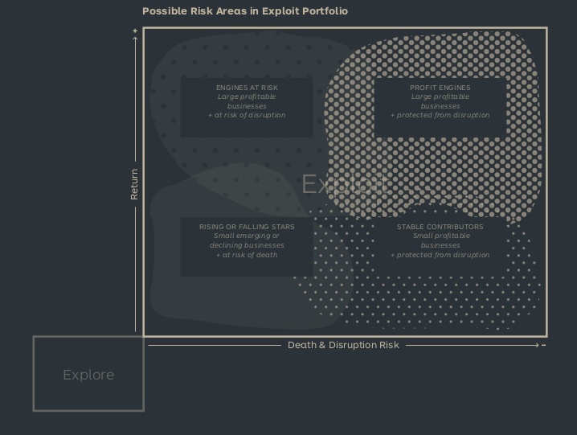

See also: [[Business Model Portfolio]], [[Portfolio Map]], [[Portfolio Management]], [[Explore]]

# Exploit

## Risks
There are 2 primary risks to business:

- Internal Business Model Design Risk
  - The risk that the business model is not designed well enough to be successful. Well designed business models are harder to disrup
- External Business Model Disruption Risk
  - The risk that a company is disrupted by external forces such as shifting markets, disruptive trends, changing supply chains and competition. See [[Key Forces]]

## Trajectories
There are 2 primary trajectories for a business:

- Growth
  - The business is growing and expanding
  - Consists of 3 phases:
    - Scale: Turning a proven opportunity into a real business. Most activites consits of customer acquisition, retention  and product/service delivery
    - Boost: Boost and maintain growth
    - Protect: Maintain the strong position the business is in. Focus on increasing efficiency and reducing costs.
- Decline
  - The business is declining and shrinking
  - Consists of 3 phases:
    - Disruption: External forces are making the business vulnerable.
    - Crisis: The business is in rapid decline, the business has not yet changed business model.
    - Shift and Reemergence: Succeed in a shift from old business model to a new one.

## Actions
There are 7 primary actions in the Exploit phase:

- Acquire: Acquire an existing business to create new a new business or merge with an existing.
- Partner: Partner with outside business to strengthen your business models.
- Invest: Bolster your portfolio by investing in an outside business.
- Improve: Improving an existing business model and shifting to the new one.
- Merge: Merging an outside business into your business.
- Divest: Stop investing by selling the business to an outside party, investors or the team.
- Dismantle: End the business.
