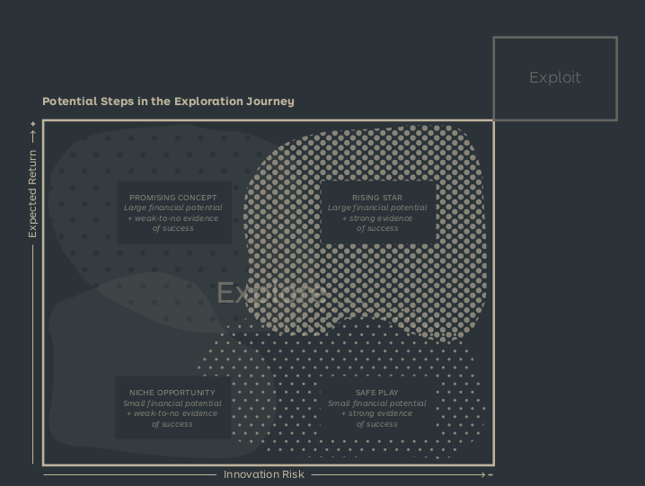

See also: [[Business Model Portfolio]], [[Portfolio Map]], [[Portfolio Management]], [[Exploit]]

# Explore - Search
Ensuring the future of the company by creating new business models.

## Myths

- The most important part is finding the perfect idea.
  - The most important part is turning ideas into business models that scale
- Evidence will show you a clear path
  - Innovation is about making informed decisions based on incomplete and contradictory evidence, while killing the right ideas.
- Small bets will lead to big wins
  - Exploration is about making lots of small bets, based on evidence, over time.
- Exploring and managing requires the same skills.
  - Exploring requires data analysis, dealing with uncertainty and conducting tests. Managing requires people skills, dealing with complexity and making decisions.
- Innovation teams are out to disrupt the company
  - Innovation teams are out to create new business models that scale, and to help the company adapt to change.

## Innovation risks
There are 4 primary risks to innovation:

- Desirability Risk
  - The business is targeting too small of a market.
- Viability Risk
  - The business is not able to create a successfull revenue streams, maybe because customers aren't willing to pay enough.
- Feasibility Risk
  - The business is not able to scale, manage or get access to key resources necessary for the new model.
- Adaptability Risk
  - The business won't be able to adapt to the competition, environment, technologies or regulations.

## Trajectories
There are 2 primary trajectories for innovation:

- Search trajectory
  - From bottom to top
  - Consists of 3 phases
    - Discovery: Understanding the customers, contect and willingness to pay. Low cost quick tests, usually for desirability and viability. Low cost quick tests, usually for desirability and viability
    - Validation: Prove interest and indications of profitability. More extensive tests for viability and desirability.
    - Accelleration: Prove scalability and profitability. Create prototypes and test with customers.
- Pivot trajectory
  - Consists of 2 phases
    - Reality check: When new testing proves your idea unlikely to work
    - Change of direction: Start again with a modified business model or idea. Analyze what parts of testing are still valuable.

## Actions
There are 7 actions that a business performs in their explore portfolio:

- Ideate: Turning oppotunities, technologies, products or services into a business model and value proposition prototypes.
- Invest: Funding an external company to widen your internal portfolio
- Persevere: Continuing to test an idea based on evidence.
- Pivot: Changing direction based on evidence.
- Retire: Killing an idea based on evidence, or when it is no longer a good fit.
- Spinout: Alternative to retire is to sell the idea to an external company, or maybe the team who came up with it.
- Transfer: Moving the idea from Explore to Exploit, based on evidence.

