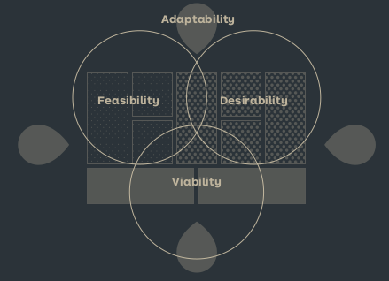

See also: [[Test]]

# Hypothesize

Identify and prioritize the most important questions, of a new business model, to answer. There are four types of hypotheses that should be explored in the following order. After creating hypotheses they should go through [[Assumption Mapping]]

## Desirability
Is it something people want?

This can be explored on both the Customer Profile and Value Proposition Canvasr or the Business Model Canvas in terms of Customer Segments, Channels, Value Proposition and Customer Relationshipts.

## Feasibility
Can we deliver the idea in a scalable way?

Should be explored on the Business Model Canvas in terms of Key Activities, Key Resources and Key Partners.

## Viability
Is it profitable?

Should be explored on the Business Model Canvas in terms of Revenue Streams and Cost Structure to generate a Profit.

## Adaptability
Can the idea adapt to changing conditions?

Should be explored in terms of [[Key Forces]]

