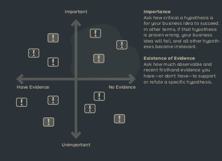

See also: [[Test]]

# Hypothesize

Identify and prioritize the most important questions, of a new business model, to answer. There are four types of hypotheses:

- Adaptability: Can the idea adapt to changing conditions?
- Feasibility: Can we deliver the idea in a scalable way?
- Viability: Is it profitable?
- Desirability: Is it something people want?

## Prioritize

It is important to prioritize the hypotheses. The most important hypotheses are those that affect the viability of the idea the most. The hypotheses should also be weighted on how much evidence you have for it. The most important hypotheses with the least information are those that you should focus on.

