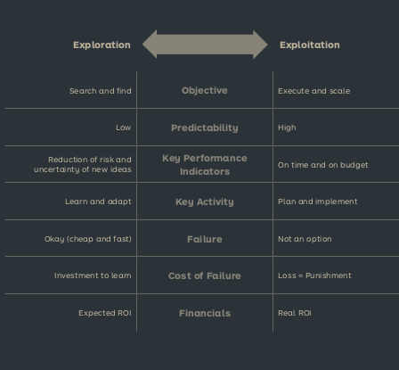
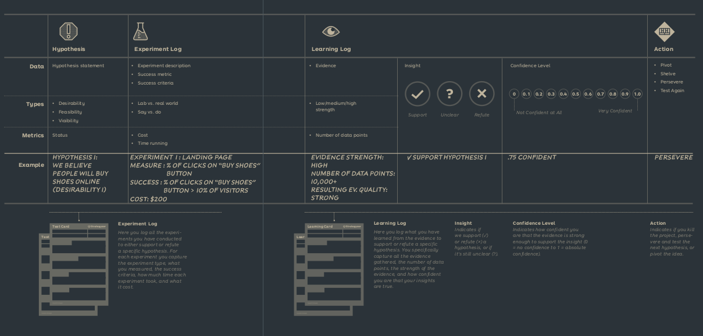
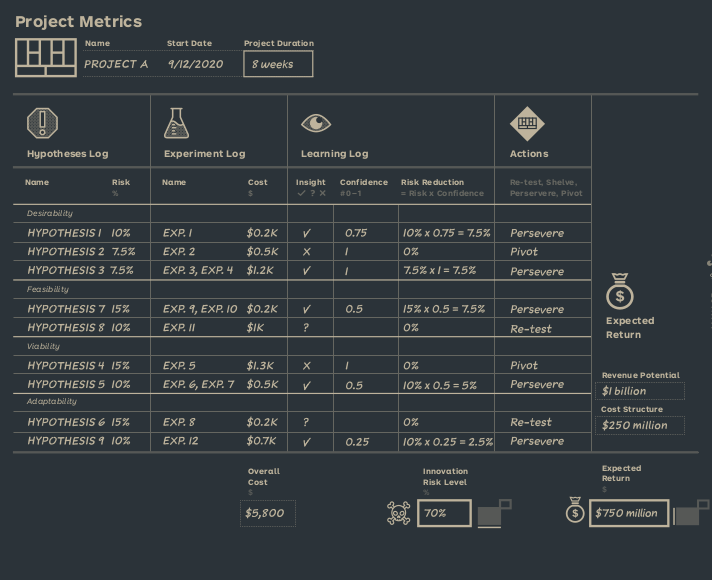

# Innovation Metrics

In innovation it's crucial to measure whether you are reducing the risk and uncertainty of a new business idea.

For every project there are 4 main metrics:

- Risk and uncertainty: How much risk has been reduced, and how much remains?
- Expected Profitibalility: How much profit is expected to be made?
- Learning Velocity and Time Spent: How much learning has been done, and how much time has been spent?
- Cost: How much has been spent testing?

Risk and uncertainty are measured on 3 different levels:

## Hypothesis Level

Here lies everything captured during conducted experiments, related to a specific hypothesis.

## Business Model Level

Collection of all hypothesis related to a specific business model. Here we can see:

- Innovation risk level: How much risk has been reduced, and how much remains?
- Expected Profitability: How much profit is expected to be made?
- Project duration: How long has been spent testing this idea?
- Overall cost: How much has been spent testing this idea?

Pivots lead to increased risk here. While reduced risk leads to more time and cost, as more expensive experiments are necessary.

## Portfolio Level

Here you can visualize the state of the entire Explore portfolio. Based on all that data we can determine which projects to retire and which to fund.
