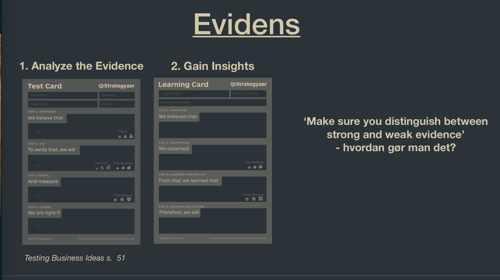

See also: [[Test]], [[Innovation Project Score Card]]

# Innovation Project Score Card
Used to evaluate Strategic fit, Risk Reduction and Size of Opportunity

## Strategic fit
Evaluate how well the project fits into the greater strategy of the company, and it's targets. Ex. don't move factories out of the US if your brand is "American Made"

## Risk Reduction
Is it even possible. Use technical experts to evaluate the risk, and how much of a toll it would take to complete the project. Experts can also help change the strategy, project or method to reduce that toll.

## Evidence

- Weak Evidence
  - Opinions and beliefs
    - Vaccines......
  - What people say
    - People may say something and do something completely different. Fx. people like the idea of alot of color, but not actually wearing it.
  - Lab settings
    - Things in a sterile controlled environment, may not act in the same way in the real world. Ex. Samsung Note 7
  - Small investments
    - If customers are willing to use a lot of money there is evidence for the product being attractive, but otherwise the product may be quite weak if the investments are small. This also counts for investors themselves. Kickstarter can be a good place to check out stuff like this.
- Strong Evidence
  - Facts
  - What people do
  - Real world settings
  - Large investments

