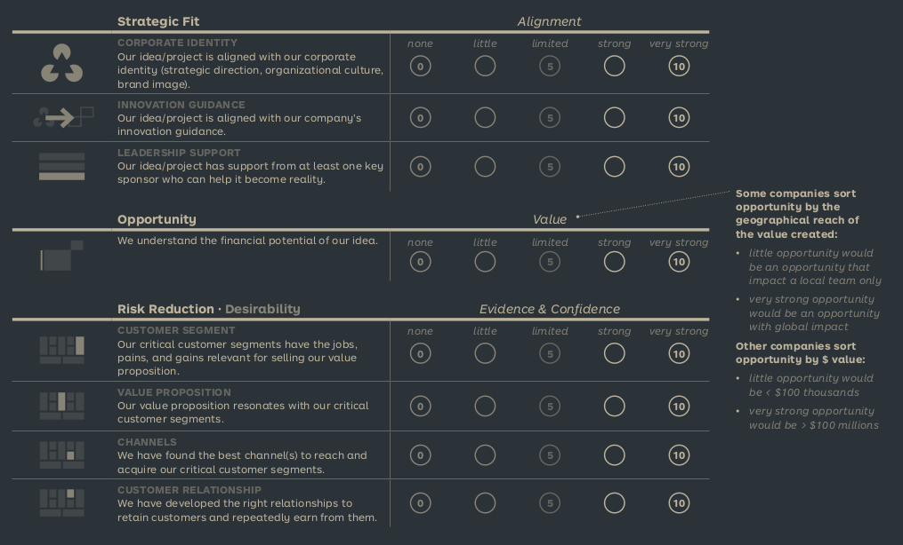
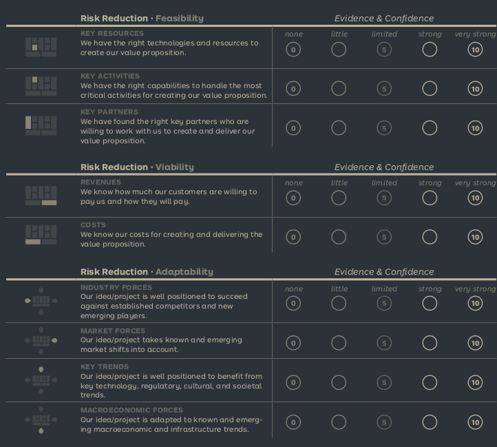

See also: [[Test]], [[Innovation Project Score Card]]

# Innovation Project Score Card
Used to evaluate Strategic fit, Risk Reduction and Size of Opportunity

## Strategic fit
Evaluate how well the project fits into the greater strategy of the company, and it's targets. Ex. don't move factories out of the US if your brand is "American Made"

## Risk Reduction
Is it even possible. Use technical experts to evaluate the risk, and how much of a toll it would take to complete the project. Experts can also help change the strategy, project or method to reduce that toll.

Look at Desirability, Feasibility, Viability and Adaptability.

## Size of Opportunity
Evaluate how viable the idea actually is.

