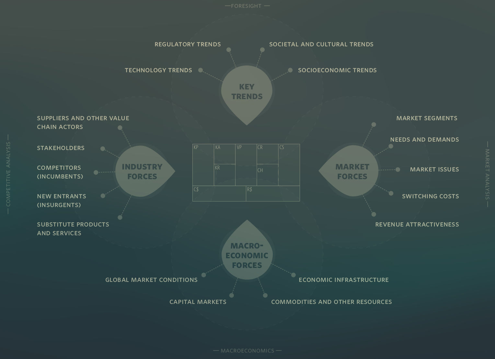
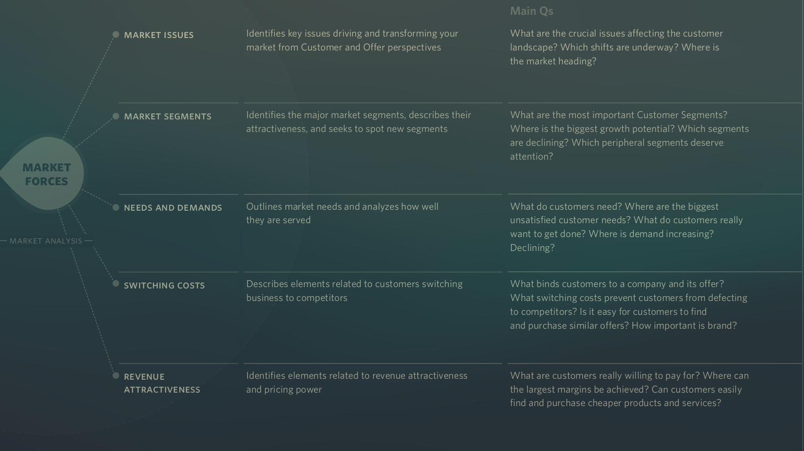
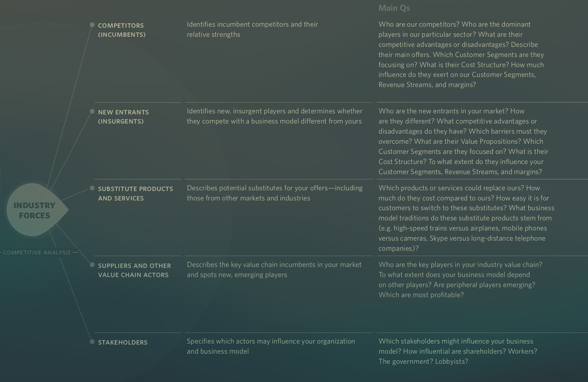
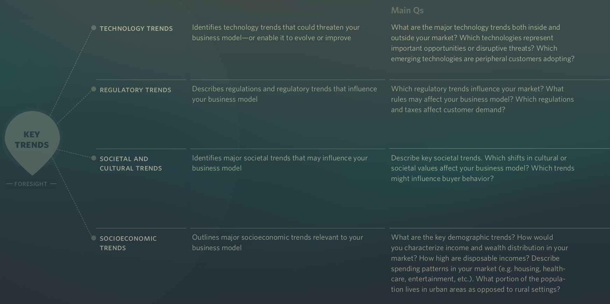
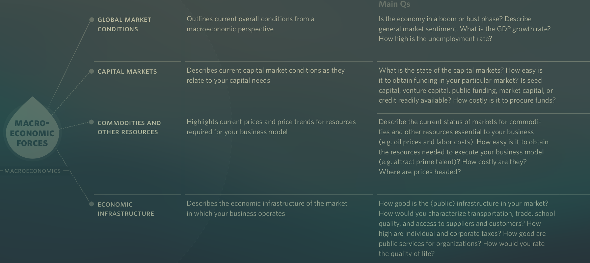

See also: [[Environment]]

# Key Forces

## Market forces (Market Analysis)

- Market issues
  - What issues are currently affecting the market, from the customers perspective?
- Market Segments
  - Which segments of the market exist, and which are most attractive/important?
- Needs and demands
  - What needs and demands do your customer segments have?
- Switching costs
  - What is binding customers to other businesses? What binds your customers to you?
- Revenue attractiveness
  - What are the cusomers willing to pay for. And how much?

## Industry forces (Competitive Analysis)

- Competitors
  - Which competitors exist, and what are their strengths and weaknesses?
- New entrants
  - Which new companies are on the market and do they compete with our business model?
- Substitute products and services
  - What other substitutes for your product/idea/service is on the market, and what makes it different/attractive.
- Suppliers and other value chain actors
  - Who are the suppliers in our industry, what are their strengths and weaknesses? What new players are there, are they a better fit/a threat?
- Stakeholders
  - Which actors may have an interest/influence on our business model?

## Key trends (Foresight)

- Technology Trends
  - What trends could affect our business model? Both positively and negatively.
- Regulatory Trends
  - What regulations affect our business model? Both positively and negatively.
- Societal and cultural trends
  - What major societal trends/events could affect our business model? Both positively and negatively.
- Socioeconomic trends
  - What major socioeconomic trends/events could affect our business model? Both positively and negatively.

## Macroeconomic Forces (Macroeconomics)

- Global market conditions
  - What is happening in the global market? Could it affect us? Is the market in a boom or bust?
- Capital markets
  - How is the capital market doing? How easy is it to get funding?
- Commodities and other resources
  - How are the curent prices and trends for resources that we need?
- Economic infrastructure
  - How is the economic infrastructure in the market? Is transportation needs met? How is the access to suppliers?

