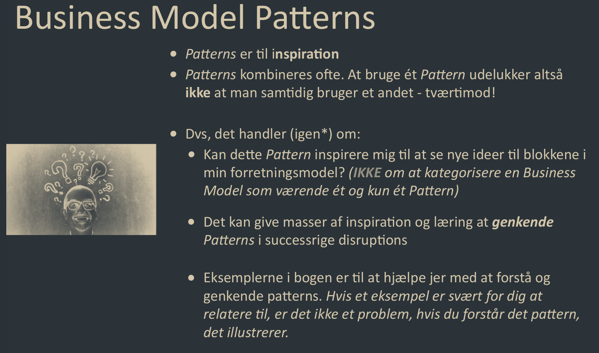

# Patterns 
A pattern is a repeatable change in business model blocks that strengthen an organizations overall business model.

There are 2 types of patterns, the Invent Patterns which change the [[Explore]] portfolio, and the Shift Patterns which change the [[Exploit]] portfolio

Pattern mentions:
- [[Frontstage Disruption]]
- [[Backstage Disruption]]
