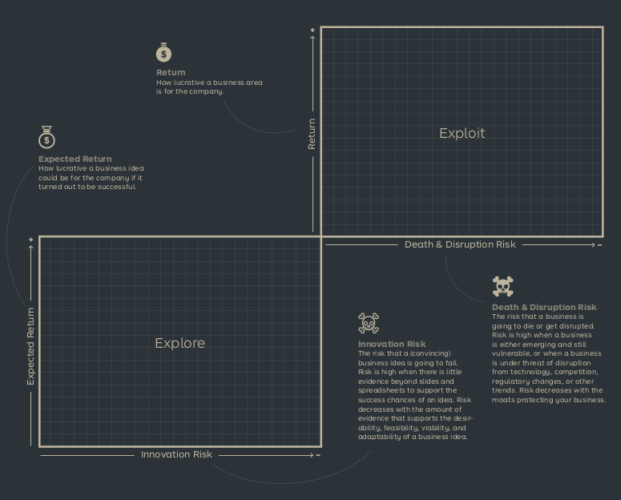

See also: [[Business Model Portfolio]]

# Portfolio Map
A tool to visualize, analyze and manage a portfolio business models. 

A portfolio map maps the exploit and explore dimensions of a portfolio. On the explore side is the expected returns and the risk of innovation. This risk decreases as there is more evidence of the new idea. On the exploit side is the return and the death/disruption risk, this is high when moving from explore to exploit or when something in the [[Key Forces]] change.

## Explore - Search
Ensuring the future of the company by creating new business models.

## Exploit - Grow
Keeping existing business models on a growth trajectory
