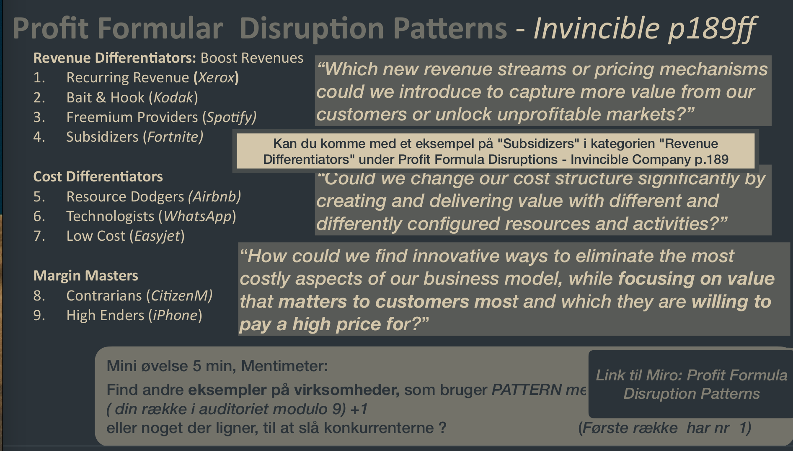

See also: [[Disruption]]

# Profit Formular Disruption
A radical change to how we make money.

## Patterns

### Revenue Differentiators
Find an innovative way to monetize a product and capture value.

**Examples**

- Recurring Revenue: Gain recurring revenue from a one-time sale (Xerox)
- Bait and Hook: Lock customers in with a base product and sell them consumables (Kodak and printers)
- Freemium Providers: Offer a free service with paid features (Spotify)
- Subsidizers: Offer the full service for free while getting revenue somewhere else (Fortnite)

### Cost Differentiators
Build a business model with a new const structure that makes activites and resources cheaper.

**Examples**

- Resource Dodgers: Eliminate the most costly resources (Airbnb)
- Technologies: Use technology to create a new cost structure (Manufacturing, WhatsApp)
- Low Cost: Combine Key Activites, Partners and Resources in new low cost ways (easyJet, RyanAir)

### Margin Masters
Make margins larger by giving the customer what the want most and keeping cost structure low.

**Examples**
- Contrarians: Eliminate the most costly Key ... and only produce the most wanted product (citizenM)
- High Enders: Focus on high end customers while keeping cost down (iPhone)

[Miro Board](https://miro.com/app/board/uXjVPJZ_1bI=/)
