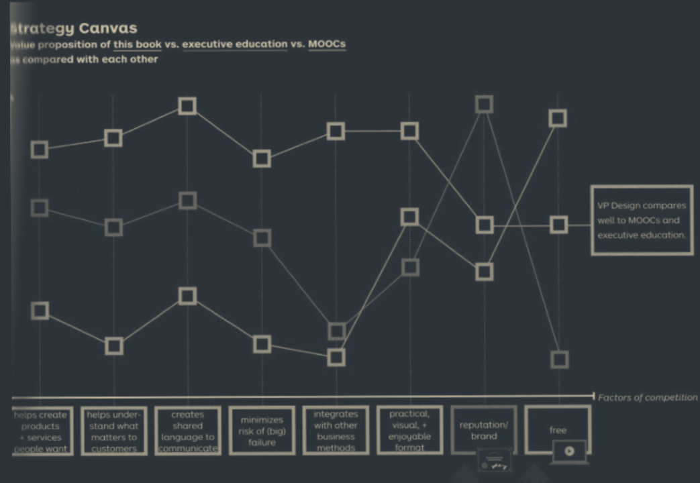

See also: [[Value Proposition Design]]

# Strategy Canvas
A Strategy Canvas is a model for comparing different Value Propositions. This tool can be a good way to compare your performance to competitors, or internal Value Propositions.

## Compare 
The process for using the Strategy Canvas is as so:

- Select a Value Proposition to compare
- Select factors to compare
  - These don't necessarily have to be the most important, but there should be a mix of gain creators and pain relievers.
- Score each factor for you
- Add competing Value Propositions
- Score each factor for each competitor
- Analyze the results
  - What are the strengths and weaknesses of your Value Proposition? What is different from you and the competition? Where are there opportunities, and where can you improve.

