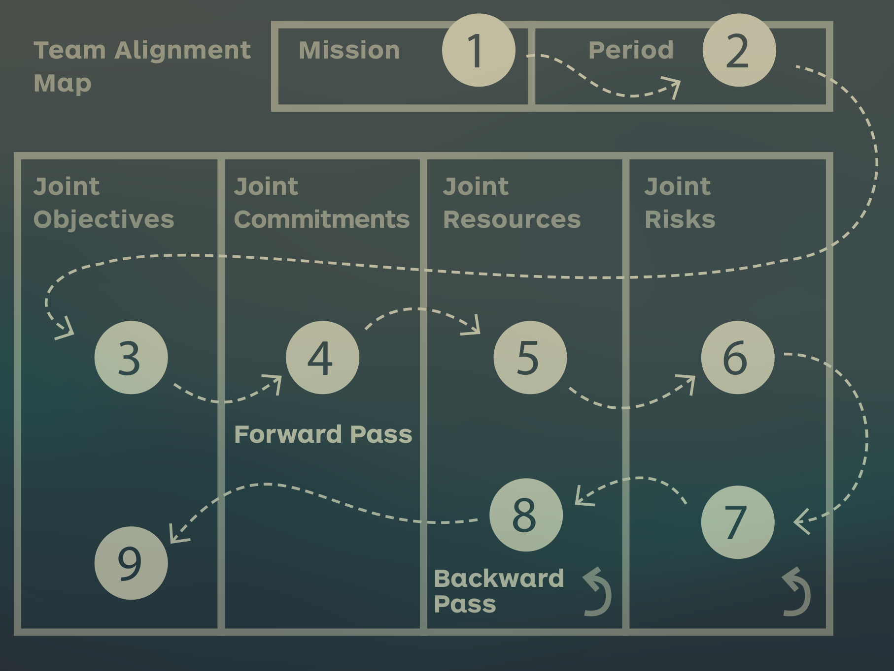

See also: [[Team Design]]

# Team Alignment
It is important that all members of the team are aligned and focussed on a single shared goal.

You can this with a Team Alignment map that goes through the following building blocks:

- Define the mission
- Define the time box
- Define the team objectives
- Identify the commitment of each member
- Document resources needed to succeed
- Document the biggest risks that could occur (Now go backwards)
- Document how to address the biggest risks by creating new objectives
- Document how to address resources risks
- Set dates for objectives

