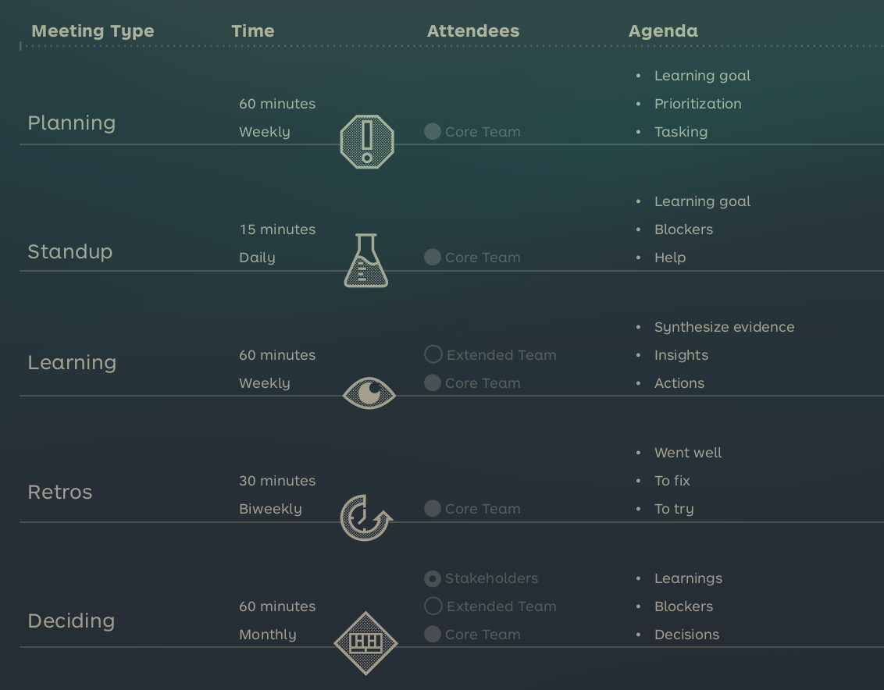

See also: [[OtherNote]]

# Test Management
To enable collaboration one can use "Ceremonies", more like meetings that are held in specific intervals and include different people. Each meeting informs the next to create a repeatable cycle of the above steps.

The time commitment of these meetings can seem overwhelming, but create good cross collaboration and isn't that much compared to actual work time (~9%).

In general think SCRUM when reading this.

## Weekly planning
Plan the upcoming week, what to hypothesis to test, prioritise the experiments and task them out.

## Daily Standups
What should we achieve today? How do we achieve it? What blockers are there?

## Weekly Learning
A weekly end of week meeting to summarise. Here you should gather your evidence, generate insights and revisit your BMC, VPC and Assumption Map.

## Biweekly Retrospective
Look back and reflect on what's happend, what you learned, what's going well, what needs improvement and what to try next.

## Monthly Stakeholder Reviews
Keep the stakeholders in the loop of what you've learned, what's blocking progress and what decisions should be taken (Pivot, kill, perservere).
