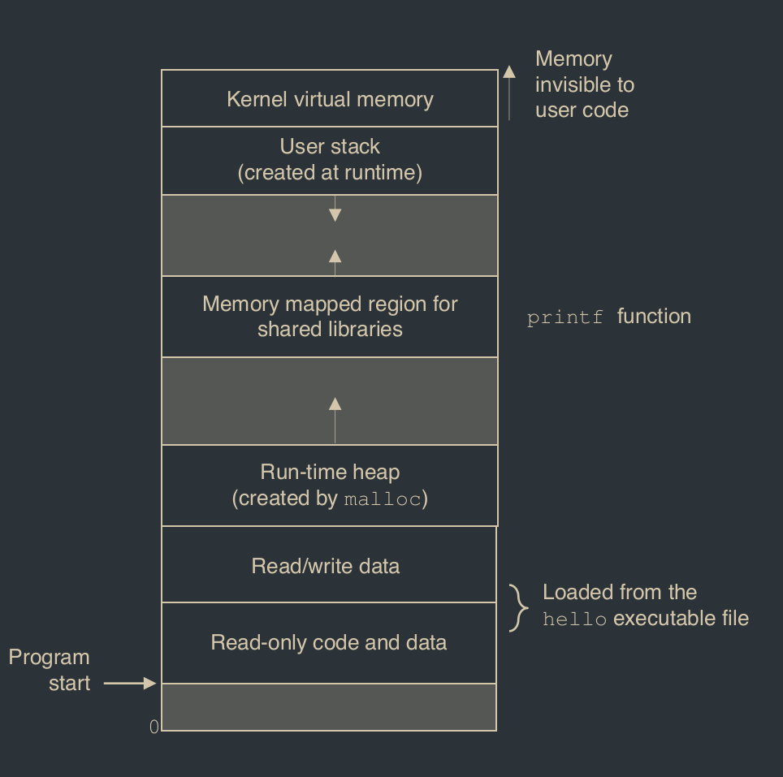
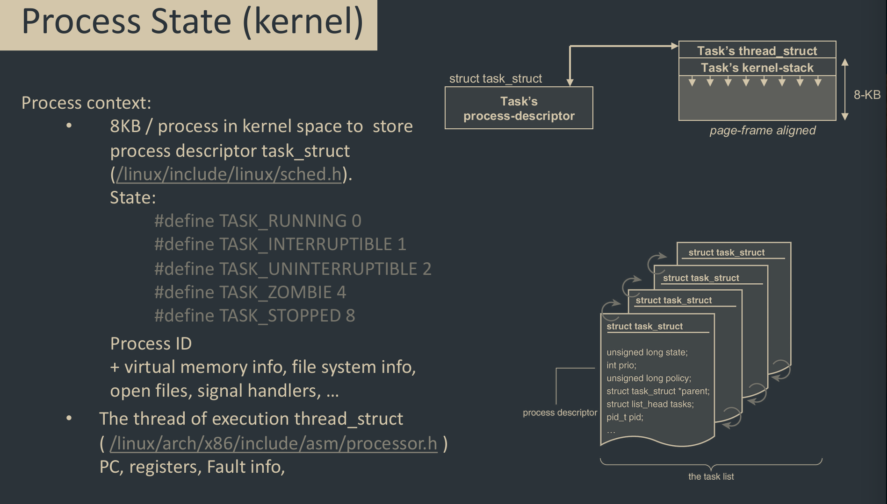

# Process
A process is it's own address space and one thread of control. A process executes a program. You can have multiple processes executiing the same program, but each process has it's own copy of the program.

Processes are arranged in a tree. Each process has a parent process which created it.

## Virtual memory

## Context switching
Control flow goes from one process to another by doing a context switch.

Supervisor vs. user modes: “Supervisor mode may provide access to different peripherals, to memory management hardware or to different memory address spaces. It is also capable of interrupt enabling, disabling, returning and loading of processor status.”

## Process state

## Process management
### fork()
- creates a new child process, that is identical to the call process.
- returns 0 to the child process
- returns child's process id (pid) to the parent process
- yeah.. it returns twice

### exit()
- exits a process
- returns 0
- atexit() registers functions to be executed upon exit

### wait()
Declaration: `int wait(int *child_status)`

Suspends current process until one of its children terminates. Return value is the pid of the terminated child.

If *child_status* is null then the object it points to will be set to a status indicating the yhte child process terminated.

### waitpid()
`waitpid(pid, &status, options)`

Suspends current process until specified process terminates.

### execve()
`int execve(char *filename, char *argv[], char *envp[])`

Loads and runs the filename with argument list and enviroment variable list envp. This is all run in the current process.

Does not return, unless error.

Overwrites code, data and stack. Though it keeps pid, open files and signal context.

## Zombies
A terminated process that still consumes system resources is called a "zombie".

To kill the zombie you perform a process called "reaping". Performed by parent on child, parent is given the exit status and the kernel should then discard the process. If this doesn't happen, and the parent terminates then the child is reaped by the init process. Therefore you only need to explicitly reap in long-running processes.

