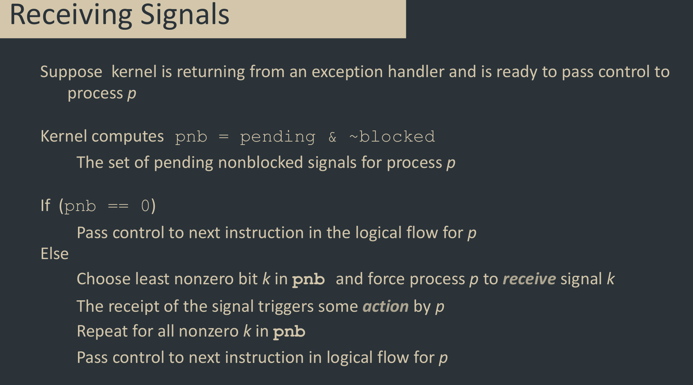

# Signals
A signal is a small message that notifies a process. It signals the occurrence of some event in the system.

Sent from the kernel to a process.

Basically like an exception or an interrupt.

Signal type is a small integer. Only information is the id and the fact that it arrived.

## Motivation
### Security
To isolate the execution of parts of the program. If a child process crashes the control process is still running.

### Performance
With multiple processes you can split parts of the execution onto multiple CPU's. This is really important if you are working with large amounts of data or long-running processes.

## Sending
Kernel sends a signal to a process by updating a state in the destination process.

They can be sent when a kernel has detected an event, such as divide-by-zero or the termination of a child. Can also be sent when a process has invoked the `kill`  system call to kill the process. This call is sent to the kernel to send the signal to the process.

## Receiving
A process receives a signal. It's forced by the kernel to react to the delivery of the signal. 

Can react by:
- Ignore the signal, still acknowledges the signal
- Terminate the process
- Catch the signal by executing a user-level function called `signal handler`

## Kernel vectors
The kernel maintains pending and blocked bit vectors in the context of each process.

- pending
  - Represents the set of pending signals
  - Kernel sets bik k in pending when a signal of type k is delivered
  - Kernel clears bit k in pending when a signal of type k is received.
- blocked
  - represents the set of blocked signals
  - can be set and cleared by using the sigprocmask function

## /bin/kill
Order 66

Can be used to kill entire families. Or just children, optimally orphans.

A child or parent can only kill itself or it's children. A child cannot kill it's parent. Parents can kill children of children. Such as the user process killing children of children.

## Default actions
Each signal type has a default action, which is one of

- The process terminates
- The process terminates and dumps core
- The process stops until restarted by a SIGCONT signal
- The process ignores the signal
