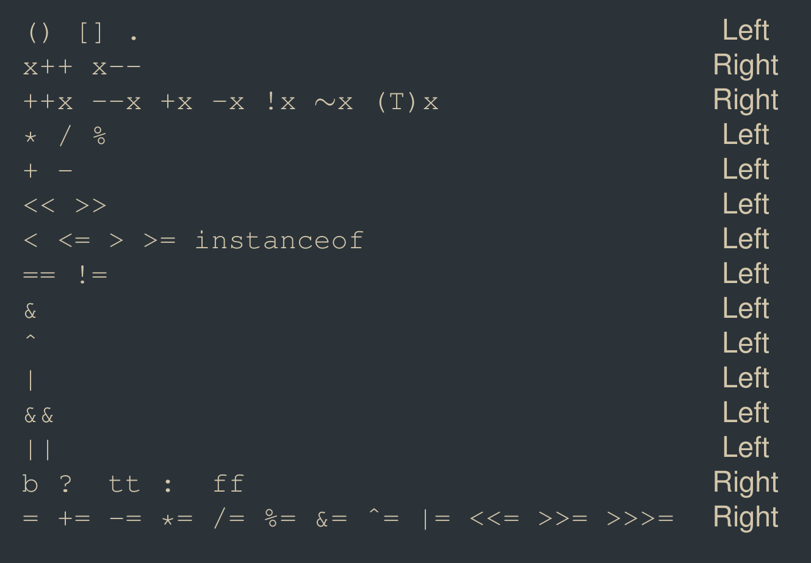

See also: [[Context-Free grammars]]

# Parser
Givven a grammar and a string - Determine whether the string can be derived, then reconstruct derivation steps.

## Associativity
When you have 2 expressions with an operator between, then those expressions are associated through the operator.

## Precedence
Some operators take precedence over others. Such as * being before +.

Java operator precedence. This image shows which side of the operator to evaluate first.

