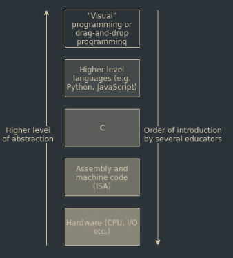

TODO: Look at the slides to write this shit down.
Note to self: You do understand it. Everything goes back to the original rules. Make a table of symbols tho.

# Group Theory

### Why?
Abstraction makes our lives easier.

Group Theory exists because we dont want to deal with the actual numbers, because the numbers are impossibly large, in security.

### [[Abelian groups]]

