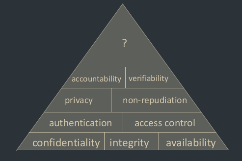

# The security Model

## [[Cybersecurity]]
Cybersecurity is the protection of computer systems

## [[Adversary]]
Biggest adversaries currently:
- Activists
- Criminals
- States
  - Big issue
  - Russia and China is very big here. But the USA wins by a long shot.

## [[Motives]] and [[Vectors]]
The biggest motives currently are
- Financial
- Disruption
- Intelligence gathering
Intelligence gathering is by far the biggest motive

In terms of vectors the most used are
- Web Server Exploits
- Trojaned Software updating
- Watering hole websites
- Spear phising

The last two are the most used, the shared thing between them is that they depend on human error.

## [[Assumptions]]
Each assumption, both technical and not, is a potential security vulnerability.

Stuxnet was a failure of assumption by assuming that moving everthing to a seperate network and only trusting engineers would be enough. Turns out the engineers could not be trusted and accidentally allowed the centrifuges to be open for flashing.

Assuming that a password policy is safe is a big mistake, because people can and will be stupid.

## [[Goals]] 

While we want the perfect world to exist, it doesn't. Security is impossibly hard. As a security engineer you must defend against all attacks, while an attacker just needs to deploy one correct attack.

There is no perfect security agains all attacks.

Security should be measured by the resources required of the adversary to deploy the correct attack.

### [[Confidentiality]]
Keep private information and data safe and private

Attacks: eavesdropping, man-in-the-middle

### [[Integrity]]
Ensure that data is correct and coming from trusted parties.

Bad example: Tesla not ensuring messages to unlock the car is from the right person, therefore allowing an attacker to unlock the car by replaying the open message.

Attacks: masquerading, message tampering, replaying.

### [[Availability]]
Ensure that a service is always available. An attacker may be interested in disrupting the flow of data, or allowing people to complete their work.

Attacks: Denial of Service, distributed denial of Service

## [[Principles]]
### [[Economy of Mechanism]]
The simpler you keep a system, the less chance there is that you fuck up. On top of that security solutions should not degrade the service.

> Complex designs yields complex failure analysis

### [[Open design]]
> "The security of a system should not depend on the secrecy of its protection mechanisms"

The more open a system is, the more scrutiny there is, therefore less defects. Therefore you should keep the design of the system open.

Look into: [[Kerckhoff's principle]]

### [[Minimum exposure]]
> "Minimise the attack surface a system presents to the adversary"

A chain is only as strong as its weakest link, therefore you should keep the chain simple. This is done by reducing the external interfaces. This limits the information an attacker can gather, and limits the window of opportunity presented to the adversary.

### [[Least privilege]]
> "Any component should operate using the least set of privileges necessary"

A user should only have the privileges they absolutely need. Fx i don't need `sudo` access on the BOSC server, but i do need the ability to read and write to my own home folder.

### [[Fail-safe defaults]]
> "The system should start in and return to a secure state in the event of a failure"

Example: In case of power cut, dont open the locks in a prison.

### [[Complete mediation]]
> "Access to any object must be monitored and controlled"

Monitor everthing, and secure everything.

### [[No single point of failure]]
> "Build redundant security mechanisms whenever feasible"

No single component should be able to fail and take down the entire system, build redundancy by design.

### [[Psychological acceptability]]
> "Design usable security mechanisms"

Allow the user to circumvent security mechanisms, but help them make the riht choice. Fx allowing an unrecognised program to run, but only if they REALLY accept it themselves.

