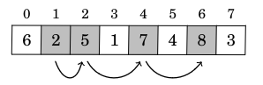
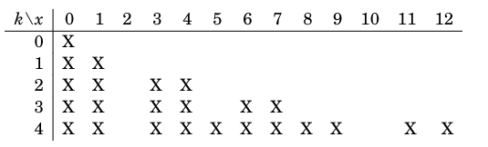

See also: [[OtherNote]]

# Dynamic Programming
Dynamic programming is a great way for finding the optimal solution or counting the number of solutions, without entirely using bruteforce. It's a challenge to implement in solutions as there really isn't an algorithm for it, it's more a state of mind.

## Memoization
Instead of a greedy algorithm, we can find the best possible solution using a dynamic programming technique called memoization. The idea of memoization is to split the problem into a bunch of smaller subproblems, which you calculate. When calculated you add it to a list that you can use for later. Essentially it ensures that you only calculate the value of a recursive function call once, fx here is fibonacci:

```python
list = []

def fib(n):
  if n == 0:
    return 0
  if n == 1:
    return 1
  if n < len(list):
    return list[n]
  else:
    list.append(fib(n-1) + fib(n-2))
    return list[n]
```

This will efficiently calculate the nth fibonacci number without recalculating it constantly.

To solve the coin problem from before the same technique is used to memorise the amount of coins to a certain number, in the case of getting 10 from [1,3,4]:

```python
coins = [1,3,4]
memo = []

def solve(x):
  if x == 0:
    return 0
  if x < 0:
    return float('inf')
  if x < len(memo):
    return memo[x]
  else:
    memo.append(min(solve(x-coin) for coin in coins) + 1)
    return memo[x]
```
Iteratively this can be done like this:

```python
coins = [1,3,4]
memo = [0]

def solve(x):
  for i in range(1, x+1):
    memo.append(float('inf'))
    for coin in coins:
      if i-coin >= 0:
        memo[i] = min(memo[i], memo[i-coin] + 1)
  return memo[x]
```

On the other hand if we want the number of ways to get to a certain number, we can do it like this:

```python
coins = [1,3,4]
n = 10 # Max value

count = [0]*10
count[0] = 1

for i in range(1, n):
  for coin in coins:
    if i-coin >= 0:
      # Add the number of ways to get to i-coin
      count[i] += count[i-coin]

def solve(x):
  return count[x]
```
  
## Longest Increasing Subsequence
The longest increasing Subsequence is a problem where you are given a list of numbers and have to find the longest chain of increasing numbers in it.



```python
a = [1,3,4,8,6,1,4,2]
# a = [6,2,5,1,7,4,8,3]
length = [1]*len(a)

for i in range(0, len(a)):
  for j in range(0, i):
    if a[j] < a[i]:
      length[i] = max(length[i], length[j] + 1)
``` 

## Knapsack
The knapsack considered here is a list of weights and you have to figure out if it's possible to construct a knapsack with a given weight from them.



```python
max_weight = 12
weights = [0,1,3,3,5]
possible = []
for i in range(0, max_weight+1):
  possible.append([False]*len(weights))

possible[0][0] = True

for i in range(1, len(weights)):
  for x in range(0, max_weight+1):
    if x-weights[i] >= 0:
      # If we remove the weight we are currently considering, can we create the remaining value with i-1 weights?
      possible[x][i] |= possible[x-weights[i]][i-1]
    # Has it previously been possible to create the value with i-1 weights?
    possible[x][i] |= possible[x][i-1]
```

