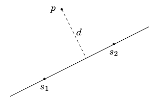
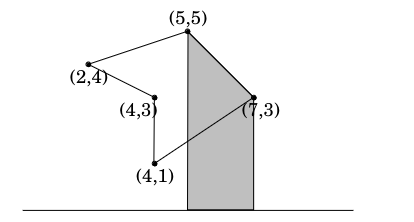
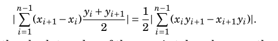

# Geometric algoritms
## Quadrilateral area
Can be calculated by splitting it into triangles, calculating the area with herons formula and then summing the areas. Problem is that splitting into triangles is easy for humans, not so much for computers. We can use a formula for calculating the area of a quadrilateral, it just doesn't scale very well

```python
def quadrilateral_area(a, b, c, d):
  (x1,y1) = a
  (x2,y2) = b
  (x3,y3) = c
  (x4,y4) = d

  return x1*y2 - x2*y1 + x2*y3 - x3*y2 + x3*y4 - x4*y3 + x4*y1 - x1*y4
```

## Herons formula
Area of a triangle given the length of its sides.

```python
from math import sqrt

def herons_formula(a, b, c):
    s = (a + b + c) / 2
    return sqrt(s * (s - a) * (s - b) * (s - c))
```

## Complex numbers
Complex numbers are of the form `a + bi` where `i` is the imaginary unit. They can be used to represent a 2d point or a vector from the origin to a point. For example 4+2i represents the vector to or point (4,2)

```python
import cmath
import math

def point_to_complex(x,y):
  return complex(x, y)

def complex_to_point(c):
  return (c.real, c.imag)

def length_of_vector(c):
  # Calculates the length of a vector from the origin to a point
  # using sqrt(a^2 + b^2)
  return abs(c)

def distance_between_points(a, b):
  # Calculates the distance between two points
  # using sqrt((a1 - a2)^2 + (b1 - b2)^2)
  return abs(a - b)

def angle_of_vector(c):
  # Calculates the angle of a vector from the origin to a point
  # using atan(b/a)
  return cmath.phase(c)

def rotate_vector(c, angle):
  # Rotates a vector from the origin to a point
  # using (a + bi) * (cos(angle) + i * sin(angle))
  return c * complex(math.cos(angle), math.sin(angle))
```

## Points and lines
### Cross product
Calculated with `a1 * b2 - a2 * b1`. If the result is positive, the vector is turning left, if it's negative, it's turning right. If it's zero, the vectors are parallel.

```python
import cmath

def cross_product(a, b):
  # Calculates the cross product of two vectors
  # using a1 * b2 - a2 * b1
  return a.real * b.imag - a.imag * b.real
```

This can also tell us if a point is on the left or right side of a line. If we have a line going through s1 and s2 then the cross product `(p-s1)x(p-s2)` tells us the location of point p. If the result is positive p is on the left side and if it's negative it's on the right side. If it's zero it's on the line.

### Line segment intersection
There are 3 cases here
- The line segments are on the same line
  - Use a cross product to check if all the points are on the same line
  - If they are, check if the line segments overlap by sorting the points and checking if the middle two points are between the other two points
- There is a common point
  - Check if the common point is on both line segments
- There is exactly one intersection point that is not a vertex on either line
  - With cross product check that the points are on different sides of the line

### Point distance from line
We can essentially use a formula derived from a triangles area for this. We can calculate the area of a triangle with `|(a-c)x(b-c)|/2` so we can derive the distance to the point as `d=((s1-p)x(s2-p))/(|s2-s1)`



```python
import cmath

def point_distance_from_line(p, s1, s2):
  # Calculates the distance from a point to a line
  # using |(a-c)x(b-c)|/|b-a|
  return abs(cross_product(s1 - p, s2 - p)) / abs(s2 - s1)
```

### Point inside polygon
Cast a ray in a few directions. If the number of intersections is odd, the point is inside the polygon. If it's even, it's outside.

## Polygon area
Can be calculated by assuming a trapezoid from one side of the polygon to the horizontal y=0 line. The area of the trapezoid is `(x_(i+1)-x_i)*(y_i+y_(i+1))/2` where the vertices of the polygon are p_i and p_(i+1). Then the area of the polygon is




```python
import cmath

def polygon_area(points):
  # Calculates the area of a polygon
  area = 0
  for i in range(len(points)):
    p1 = points[i]
    p2 = points[(i + 1) % len(points)]
    area += p1.real * p2.imag - p2.real * p1.imag
  return abs(area) / 2
```

### Picks theorem
According to Picks theorem if a polygon has all integer coordinates then the area is `a+b/2-1` where a is the number of points inside the polygon and b is the number of points on the edge of the polygon.

## Distance functions
### Euclidian distance
The distance between two points is `sqrt((x1-x2)^2+(y1-y2)^2)`

```python
import cmath
import math

def euclidian_distance(a, b):
  # Calculates the distance between two points
  # using sqrt((a1 - a2)^2 + (b1 - b2)^2)
  return abs(a - b)
```

### Manhattan distance
The distance between two points is `|x1-x2|+|y1-y2|`. Makes sense if you can only move in 4 directions.

```python
import cmath
import math

def manhattan_distance(a, b):
  # Calculates the distance between two points
  # using |a1 - a2| + |b1 - b2|
  return abs(a.real - b.real) + abs(a.imag - b.imag)
```

#### Rotating coordinates
Some problems are easier with manhattan distance, such as calculating the maximum distance between 2 points. We can rotate the coordinates 45 degrees to make the manhattan distance larger because `(x,y)` becomes `(x+y, y-x)`. 

Take `p1 = (1,0)` and `p2 = (3,3)` rotated is `p1' = (1,-1)` and `p2' = (6,0)` so the distance is `|1-6|,|-1-0| = 5` instead of `|1-3|+|0-3| = 2`.

```python
import cmath
import math

def rotate_coordinate(p):
  # Rotates coordinates 45 degrees
  # using (x, y) -> (x + y, y - x)
  return complex(p.real + p.imag, p.imag - p.real)

def max_distance(a, b):
  a_rotated = rotate_coordinate(a)
  b_rotated = rotate_coordinate(b)
  return max(abs(a_rotated.real - b_rotated.real), abs(a_rotated.imag - b_rotated.imag))
```

## Sweep line
The act of representing a set of events as points and lines on a plane. Fx a calendar can be represented as 2 points in time. We can then calculate intersections. Or just move along the lines increasing a counter once a new line starts, and decreasing it when another ends. This technique could also be used to find scheduling conflicts.

## Intersection points
Given a set of line segments, either horizontal or vertical, find the total number of intersection points. Easy in O(n^2) but can be done in O(nlogn) with a sweep line. The naive solution is to just calculate the intersection point of each line with each other line.

The sweep line on the other hand, sorts the lines by their x coordinate. Then we can move along the x axis and keep track of the y coordinates of "active" lines. When reaching a vertical segment we check if it's y coordinates are around the currently stored ones, if they are the counter is increased. Store the y coordinates in a segment tree or binary indexed tree, then the complexity is O(n log n) as each event takes O(log n) to process.

## Closest pair problem
Given a set of points, find the 2 points with the minimum Euclidian distance. Can be solved with a sweep line. Keep track of the current minimum distance, then go from left to right. At each point find the nearest point to the left of the line, if the distance is less than than the stored distance, then store it. The great thing is that since we store the distance we only have to check `x-d,x` for x and `y-d, y+d` behind the line since if it's above those values, then the distance wouldn't be updated. The region always only contains O(1) points and we can go through them in O(log n) by simply maintaining a list of the points that uphold the x coordinate criteria. Therefore, since we go through all points the complexity is O(n log n).

## Convex hull
A convex hull is the smallest polygon that contains all points in a given set. Convex means enclosed, all the line segments are complete. The convex hull can be found with Andrew's algorithm.

### Andrew's algorithm
- Locate the leftmost and rightmost points, call them A and B
- Split the points into 2 sets, one above and one below the line AB
- Find the upper hull
  - Sort the points by their x coordinate, then their y coordinate
  - Iterate each point and add it to the hull, making sure the line never turns left. If it does remove the second last point until it doesnt.
- Find the lower hull
  - Same as above but in reverse
- Concat the upper and lower hulls, removing the first and last point of each hull as they are the same point

Runs in O(n log n) since we sort the points.
