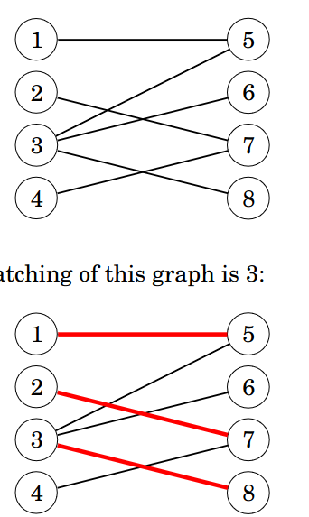
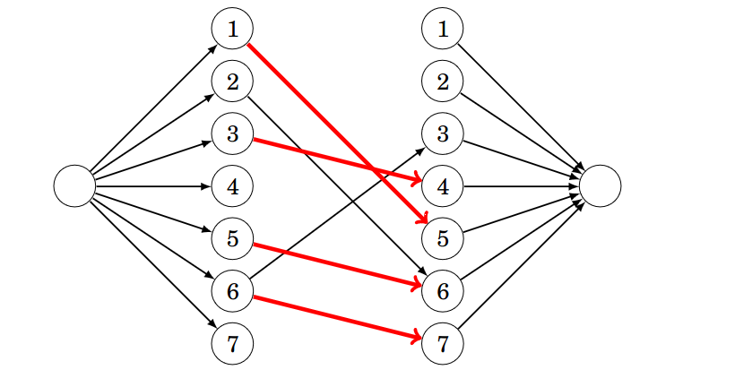
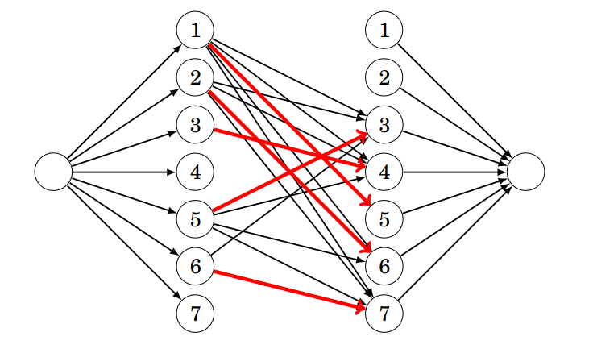

See also: [[OtherNote]]

# Network Flow
## Maximum flow
The maximum amount of flow we can send from one node to another.

### Ford-fulkerson
Creates a reverse edge for each edge. In every round it finds a path from the source to the sink, over edges that still have free capacity. Then it adds the largest common flow to all the edges. this value is essentially the smallest free flow of any of the edges in the path. This value is also added to the maximum flow value.

If at some point it's necessary to cancel the flow, it can be added to the reverse edge.

Ford-fulkerson does not specify a path finding algorithm, and technically both supports BFS and DFS, one implementation is the Edmonds-Karp algorithm, which uses BFS, this has a running time of $O(m^2n$.

Alternatively the scaling algorithm uses DFS where it only selects edges that are a threshold value. This is usually set to the sum of the edge weights, and then divided by 2 each time a path cannot be found. 

## Minimum cut
Minimum-weight set of edges that separates two nodes in the graph. Essentially you want to remove a set of edges, with the smallest possible sum, that ensures there is no path from the source to the sink, the sum of these edges are always the same as the maximum flow value.

To find the minimum cut we can consider the graph as 2 sets, one containing the sink, and one containing the source. They can each contain some amount of nodes. The edges connecting the nodes in between those sets are what must be cut, and therefore must be minimized. Since a graph cannot contain a flow higher than the weight of any cut of the graph, the maximum flow must be the sum of the minimum cut. Therefore you simply have to figure out which edges have all their flow used, and that will be your cut.

## Disjoint paths
Can be reduced to a maximum flow problem.

### Edge-disjoint paths
An edge disjoint path is a path that does not share an edge with a different path.

If you set the capacity of all edges to one, then the max flow value is equal to the number of edge-disjoint paths

### Node-disjoint paths
A node disjoint path is a path that does not share a node with a different path.

Create 2 nodes for each node, one has all incoming edges and the other all outgoing paths, then a connecting edge between with a capacity of 1.

### Maximum Matching
A maximum matching problem tasks you with finding a maximum set of node pairs such that each pair is connected with an edge, and each node belongs to at most one pair.

This can be reduced to a maximum flow problem in bipartite graphs (A graph where all edges go from one group to another group).

It can be solved by adding a sink, and connecting it to all the members of one group, and then a source and connecting it to all members of another group. Then run maximum flow and you have the number of pairs.

## Path covers
A set of paths in a graph such that each node of the graph belongs to at least one path.

### Node-disjoint path cover
Each node belongs to exactly one path. A path can contain no edges, aka just one node.

To solve this we create a graph containing 2 of each node, and a connection between them if there was in the original, then run the maximum matching algorithm, the result is a graph where each edge constitutes an edge in the minimum Node-disjoint path cover of the original graph, therefore the solution is $n-c$ where n is the number of nodes in the original graph and c is the size of the maximum matching.

### General path cover
Can be found in almost the same way, but you first have to calculate all the paths in the graph from every node to every node, and then in the matching graph add an edge if there is a path from one node to another.

