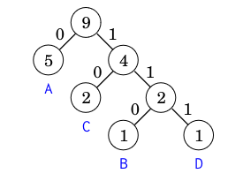
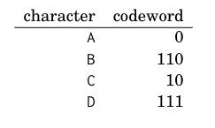

See also: [[OtherNote]]

# Problem solving paradigms
## Complete search
The act of bruteforcing every solution to the problem and selecting the best solution, or possibly counting the number of solutions.
It's easy to implement, but is incredibly slow. Can be mixed with greedy or dynamic programming to speed up the process.
Recursion is a common way to implement complete search.

### Generating subsets
```cpp
void search(int k) {
  if (k == n) {
    // process subset
  } else {
    search(k+1);
    subset.push_back(k);
    search(k+1);
    subset.pop_back();
  }
}
```
This code does a search both with the element and without, using recursion.

An approach using bit representations:
```cpp
for (int b = 0; b < (1<<n); b++) {
  vector<int> subset;
  for (int i = 0; i < n; i++) {
    if (b&(1<<i)) subset.push_back(i);
  }
}
```

### Generating permutations
```cpp
void search() {
  if (permutation.size() == n) {
    // process permutation
  } else {
    for (int i = 0; i < n; i++) {
      if (chosen[i]) continue;
      chosen[i] = true;
      permutation.push_back(i);
      search();
      chosen[i] = false;
      permutation.pop_back();
    }
  }
}
```
This code uses a boolean array to keep track of which elements have been used, and uses recursion to generate all permutations.

An iterative method is also possible, but is more complicated.
```cpp
vector<int> permutation;
for (int i = 0; i < n; i++) {
  permutation.push_back(i);
}
do {
  // process permutation
} while (next_permutation(permutation.begin(),permutation.end()));
```

### Backtracking
Backtracking algorithms start out like complete search, but abandons a search branch when it determines that the branch cannot possibly lead to a valid solution.

A solution to the N-queens problem is shown below.
```cpp
void search(int y) {
  if (y == n) {
    count++;
    return;
  }
  for (int x = 0; x < n; x++) {
    if (column[x] || diag1[x+y] || diag2[x-y+n-1]) continue;
    column[x] = diag1[x+y] = diag2[x-y+n-1] = 1;
    search(y+1);
    column[x] = diag1[x+y] = diag2[x-y+n-1] = 0;
  }
}
```

A backtracking algorithm is usually improved by adding additional pruning rules, in searching a grid where you visit every square fx, you can exit as soon as you cannot go forward, but can go both right and left, or when you hit the exit without having visited every square.

### Meet in the middle
Meet in the middle is a technique where you split the problem into two parts, and solve each part separately, and then combine the solutions. This can lower the time complexity considerably.

## Greedy algorithms
Greedy algorithms are algorithms that make the locally optimal choice at each step, with the hope of finding a global optimum. The difficulty of these algorithms is finding a strategy that always produces an optimal solution.

In the coin problem fx. you can always take the largest coin that fits, and repeat until you have the desired amount. This is a greedy algorithm. But it's not always optimal, if goal is 6 with coins {1,3,4} it will select 4+1+1, but the optimal solution is 3+3.

Greedy algoritms are great for scheduling problems, fx. when you want to minimize the number of tasks that are late, you can always select the task that is closest to the deadline. Or when you want to optimize a task schedule, select the tasks that take the shortest time to finish first.

Template:

- S is the empty solution
- Order the input elements in a certain way, e.g., by "contribution to a solution" 
- Go through input elements one by one:
  - If adding current element to S is a valid solution, add it
  - Otherwise skip it
- Return S

### Huffman coding
Huffman coding is a lossless data compression algorithm. It uses a greedy algorithm to find the optimal prefix code for a given alphabet with associated frequencies. It does so by constructing a graph based on the frequencies, this can then be used to parse it later.



