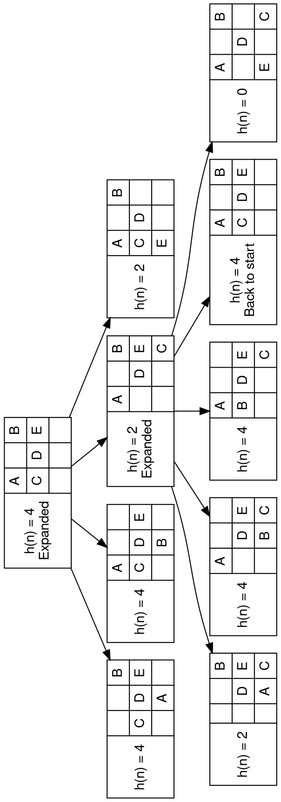
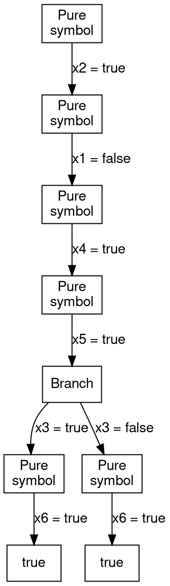

# 2017
## Problem 1
### Part a
The following is denoted as "<knight>: <conflicts> - <knights it can attack>"
```
A: 1 - E
B: 1 - C
C: 1 - B
D: 0 - 
E: 1 - A
```

### Part b
We use the previous problem as the first state, denote as 

| $A^1$  | $\ ^0$ | $B^1$  |
|--------|--------|--------|
| $C^1$  | $D^0$  | $E^1$  |
| $\ ^0$ | $\ ^0$ | $\ ^0$ |

Then we take a step, using $A$ as the first *var* variable. We can move $A$ one square to the left to minimize it's conflicts

| $\ ^0$ | $A^0$  | $B^1$  |
|--------|--------|--------|
| $C^1$  | $D^0$  | $E^0$  |
| $\ ^0$ | $\ ^0$ | $\ ^0$ |

Since this is still not a solution, we iterate again, taking $B$ as the $var$ variable. We can move $B$ to the bottom middle to remove it's conflicts

| $\ ^0$ | $A^0$  | $\ ^0$ |
|--------|--------|--------|
| $C^0$  | $D^0$  | $E^0$  |
| $\ ^0$ | $B^0$  | $\ ^0$ |

There are no more conflicts, therefore this is a solution, and iteration ends.

Solution returned:
|   | A |   |
|---|---|---|
| C | D | E |
|   | B |   |

### Part c
$h(n)$ is a valid solution since it is zero when achieving the goal state, and will never be negative.

### Part d
$h(n)$ is not admissible since it will overestimate the cost to reach the goal state. Because if a knight has a conflict, there is a corresponding conflict, and the heuristic will be 2. However, the cost to reach the goal state is 1.

### Part e


### Part f
Solution returned:
| A |   | B |
|---|---|---|
|   | D |   |
| E |   | C |

### Part g
That would be a valid solution, it would relax how the knights can move and would be both an admissible and consistent heuristic.

## Problem 2
### Part a
- (i) $(x_1 \lor x_2 \land (x_3 \lor x_4) \land (x_5 \lor x_6)$
- (ii) $x_1 \Leftrightarrow x_5$
- (iii) $(x_1 \Rightarrow \lnot x_3) \land (x_3 \Rightarrow \lnot x_5)$
- (iv) $(x_3 \lor x_4) \Rightarrow x_6$

Conveted to CNF:
- (i) $(x_1 \lor x_2 \land (x_3 \lor x_4) \land (x_5 \lor x_6)$
- (ii) $x_1 \Leftrightarrow x_5$
    - $\equiv (x_1 \Rightarrow x_5) \land (x_5 \Rightarrow x_1)$
    - $\equiv (\lnot x_1 \lor x_5) \land (\lnot x_5 \lor x_1)$
- (iii) $(x_1 \Rightarrow \lnot x_3) \land (x_3 \Rightarrow \lnot x_5)$
    - $\equiv (\lnot x_1 \lor \lnot x_3) \land (\lnot x_3 \lor \lnot x_5)$
- (iv) $(x_3 \lor x_4) \Rightarrow x_6$
    - $\equiv \lnot (x_3\lor x_4) \lor x_6$
    - $\equiv (\lnot x_3\land \lnot x_4) \lor x_6$
    - $\equiv (\lnot x_3 \lor x_6) \land (\lnot x_4 \lor x_6)$

### Part b
CNF:
- Start:  $(\lnot x_5 \lor x_2) \land (x_5 \lor x_6) \land (\lnot x_3 \lor x_4) \land (x_1 \lor x_2) \land (x_6 \lor \lnot x_3) \land (\lnot x_1 \lor \lnot x_4) \land (x_3 \lor \lnot x_6) \land (x_3 \lor x_4) \land (\lnot x_1 \lor x_2)$
    - Not true
    - Not false
    - Find pure symbol: $x_2$, set value to true
- $(\lnot x_5 \lor true) \land (x_5 \lor x_6) \land (\lnot x_3 \lor x_4) \land (x_1 \lor true) \land (x_6 \lor \lnot x_3) \land (\lnot x_1 \lor \lnot x_4) \land (x_3 \lor \lnot x_6) \land (x_3 \lor x_4) \land (\lnot x_1 \lor true)$
    - Not true
    - Not false
    - Find pure symbol: $x_1$, set value to false
- $(\lnot x_5 \lor true) \land (x_5 \lor x_6) \land (\lnot x_3 \lor x_4) \land (false \lor true) \land (x_6 \lor \lnot x_3) \land (false \lor \lnot x_4) \land (x_3 \lor \lnot x_6) \land (x_3 \lor x_4) \land (\lnot false \lor true)$
    - Not true
    - Not false
    - Find pure symbol: $x_4$, set value to true
- $(\lnot x_5 \lor true) \land (x_5 \lor x_6) \land (\lnot x_3 \lor true) \land (false \lor true) \land (x_6 \lor \lnot x_3) \land (false \lor true) \land (x_3 \lor \lnot x_6) \land (x_3 \lor true) \land (\lnot false \lor true)$
    - Not true
    - Not false
    - Find pure symbol: $x_5$, set value to true
- Branch
    - $(true \lor true) \land (true \lor true) \land (\lnot x_3 \lor true) \land (false \lor true) \land (true \lor \lnot x_3) \land (false \lor true) \land (x_3 \lor true) \land (x_3 \lor true) \land (false \lor true)$
        - Not true
        - Not false
        - Find pure symbol: $x_3$, set value to true
    - $(true \lor true) \land (true \lor false) \land (\lnot x_3 \lor true) \land (false \lor true) \land (false \lor \lnot x_3) \land (false \lor true) \land (x_3 \lor false) \land (x_3 \lor true) \land (false \lor true)$
        - Not true
        - Not false
        - Find pure symbol: $$, set value to true




### Part c
Not exactly. Forward chaining would be a good option if there was known data. On the other hand backward-chaining is a much better fit when a question is asked, as it will work backwards to find the necessary data for the question to be answered. You could set $x_6$ to false and see if a solution exists that allows for $x_6$ to be false.

### Part d
See [tex file](./2017-d.tex)

### Part e
There are only 2 paths leading from $x_3$ to $1$ therefore there are only 2 movie programs.

## Problem 3
### Part a
True

### Part b
False, it's the opposite way around.
The Degree heuristic is best used as a tie breaker, while the Minimum Remaining Values heuristic is best used as the primary heuristic, as it finds inconsistiencies faster.

### Part c
True

### Part d
True

### Part e
False, global constraints do increase the propagation of constraints, they add to the complexity of the problem.
