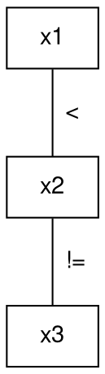
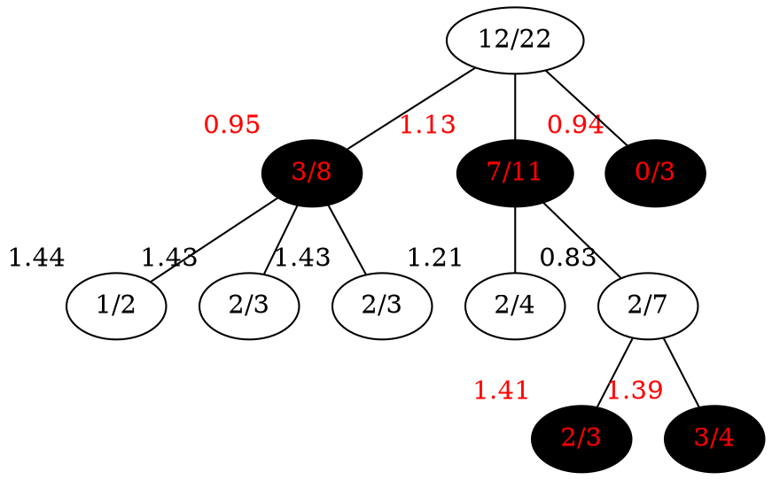
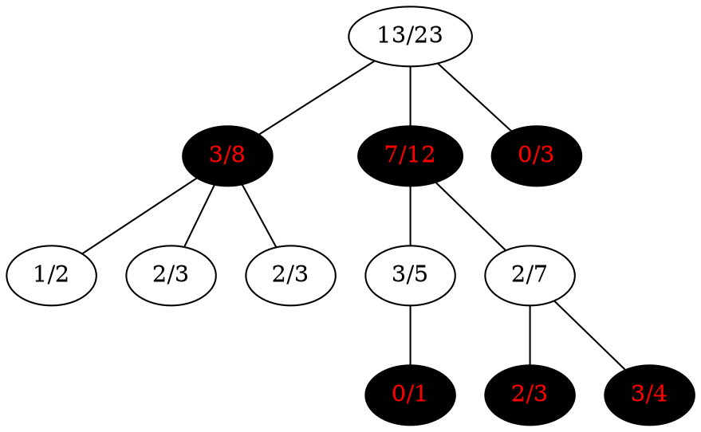

# 2023
## Problem 1
### Part a

### Part b
- Iteration 0
    - Queue: $x_1 \rightarrow x_2$, $x_2 \rightarrow x_1$, $x_2 \rightarrow x_3$, $x_3 \rightarrow x_2$ 
    - Domains: $x_1 = \{1, 2\}$, $x_2 = \{1, 2\}$, $x_3 = \{1, 2\}$
- Iteration 1
    - Queue: $x_2 \rightarrow x_1$, $x_2 \rightarrow x_3$, $x_3 \rightarrow x_2$ 
    - Domains: $x_1 = \{2\}$, $x_2 = \{1, 2\}$, $x_3 = \{1, 2\}$
- Iteration 2
    - Queue: $x_2 \rightarrow x_3$, $x_3 \rightarrow x_2$, $x_3 \rightarrow x_2$
    - Domains: $x_1 = \{1\}$, $x_2 = \{2\}$, $x_3 = \{1, 2\}$
- Iteration 3
    - Queue: $x_3 \rightarrow x_2$, $x_3 \rightarrow x_2$, $x_1 \rightarrow x_2$
    - Domains: $x_1 = \{1\}$, $x_2 = \{2\}$, $x_3 = \{1, 2\}$
- Iteration 4
    - Queue: $x_3 \rightarrow x_2$, $x_1 \rightarrow x_2$
    - Domains: $x_1 = \{1\}$, $x_2 = \{2\}$, $x_3 = \{1\}$
- Iteration 5
    - Queue: $x_1 \rightarrow x_2$
    - Domains: $x_1 = \{1\}$, $x_2 = \{2\}$, $x_3 = \{1\}$
- Iteration 6
    - Queue:
    - Domains: $x_1 = \{1\}$, $x_2 = \{2\}$, $x_3 = \{1\}$

### Part c
It returns true since it the domain never became empty. Therefore there is a or more solutions, in this case one where $x_1 = 1$, $x_2 = 2$, and $x_3 = 1$.

### Part d
The degree heuristic selects the node with most constraints. In this case it would select $x_2$ first since it has two constraints, therefore it would assign $x_2$ first.

## Problem 2
### Part a
Alpha beta search is really inefficient if the branching factor is high, which it is in Go. Therefore Monte-Carlo tree search should be used instead.

### Part b

### Part c
The latter part of the UCT equation $C \sqrt{\frac{\ln N}{n}}$ adds a relatively large value to the score of a node that has not been visited many times. This is to ensure that the algorithm explores new nodes, and not just the ones that have been visited many times.

We call it the exploration term.

### Part d
MCTS recursively picks according to the highest UCT value. So it would take $7/11$, then $2/4$.

### Part e

The tree would recursively search for the most played node. So $8/12\rightarrow2/7\rightarrow3/4$

## Problem 3
### Part a
$S_2=\{r,g,y\}$

### Part b
Simply change it to B not being part of it $S_2(x_1,x_0)=\lnot x_1 \lor x_0\equiv x_0\Rightarrow x_1$

### Part c
$x_0 \rightarrow 1, (x_1\rightarrow 0,1)$

### Part d
See [2023-3-d.tex](2023-3-d.tex)

### Part e
Since a characteristic function must return true. And that the intersection means the marble must be in both sets. We can simply define it as $S_4(x_1,x_0)=S_2(x_1,x_0)\land S_3(x_1,x_0)$
